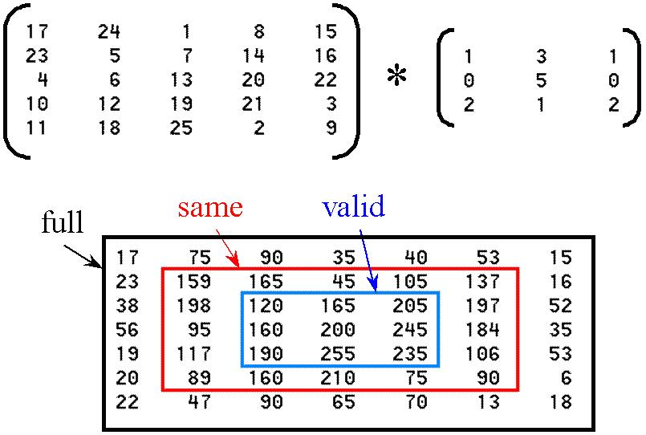

  
Reference  
[http://www.johnloomis.org/ece563/notes/filter/conv/convolution.html](http://www.johnloomis.org/ece563/notes/filter/conv/convolution.html)  
[https://stackoverflow.com/questions/37145895/how-is-full-convolution-performed-using-matlabs-conv2-function](https://stackoverflow.com/questions/37145895/how-is-full-convolution-performed-using-matlabs-conv2-function)  
