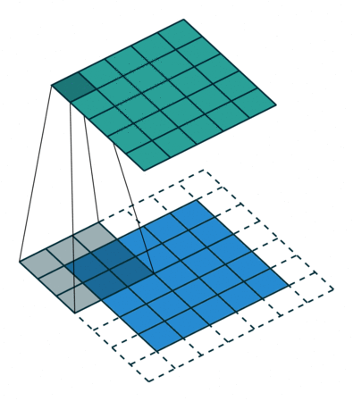
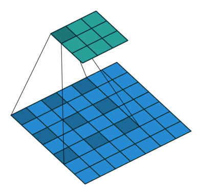
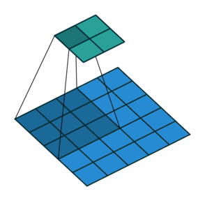
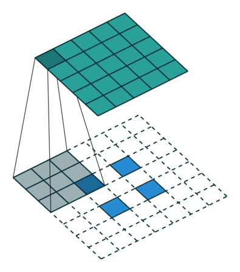
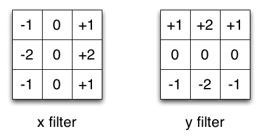

## [An Introduction to different Types of Convolutions in Deep Learning](https://medium.com/towards-data-science/types-of-convolutions-in-deep-learning-717013397f4d)  
Let me give you a quick overview of different types of convolutions and what their benefits are. For the sake of simplicity, 
I’m focussing on 2D convolutions only.  
### Convolutions
First we need to agree on a few parameters that define a convolutional layer.  
**Kernel Size**: The kernel size defines the field of view of the convolution. A common choice for 2D is 3 — that is 3x3 pixels.  
**Stride**: The stride defines the step size of the kernel when traversing the image. 
While its default is usually 1, we can use a stride of 2 for downsampling an image similar to MaxPooling.  
**Padding**: The padding defines how the border of a sample is handled. A (half) padded convolution will keep the spatial output 
dimensions equal to the input, whereas unpadded convolutions will crop away some of the borders if the kernel is larger than 1.  
**Input & Output Channels**: A convolutional layer takes a certain number of input channels (I) and calculates a specific 
number of output channels (O). The needed parameters for such a layer can be calculated by I*O*K, where K equals the number 
of values in the kernel.  
#### 2D convolution using a kernel size of 3, stride of 1 and padding
  

### Dilated Convolutions
**(a.k.a. atrous convolutions)**  
Dilated convolutions introduce another parameter to convolutional layers called the **dilation rate**. This defines a spacing 
between the values in a kernel. A 3x3 kernel with a dilation rate of 2 will have the same field of view as a 5x5 kernel, 
while only using 9 parameters. Imagine taking a 5x5 kernel and deleting every second column and row.  
This delivers a wider field of view at the same computational cost. Dilated convolutions are particularly popular in the field 
of real-time segmentation. Use them if you need a wide field of view and cannot afford multiple convolutions or larger kernels.  
#### 2D convolution using a 3 kernel with a dilation rate of 2 and no padding
  

### Transposed Convolutions
**(a.k.a. deconvolutions or fractionally strided convolutions)**
Some sources use the name deconvolution, which is inappropriate because it’s not a deconvolution. To make things worse 
deconvolutions do exists, but they’re not common in the field of deep learning. An actual deconvolution reverts the process 
of a convolution. Imagine inputting an image into a single convolutional layer. Now take the output, throw it into a black 
box and out comes your original image again. This black box does a deconvolution. It is the mathematical inverse of what a 
convolutional layer does.  
A transposed convolution is somewhat similar because it produces the same spatial resolution a hypothetical deconvolutional 
layer would. However, the actual mathematical operation that’s being performed on the values is different. A transposed 
convolutional layer carries out a regular convolution but reverts its spatial transformation.  
At this point you should be pretty confused, so let’s look at a concrete example. An image of 5x5 is fed into a convolutional 
layer. The stride is set to 2, the padding is deactivated and the kernel is 3x3. This results in a 2x2 image.  
If we wanted to reverse this process, we’d need the inverse mathematical operation so that 9 values are generated from each 
pixel we input. Afterward, we traverse the output image with a stride of 2. This would be a deconvolution.  
#### 2D convolution with no padding, stride of 2 and kernel of 3
  
A transposed convolution does not do that. The only thing in common is it guarantees that the output will be a 5x5 image 
as well, while still performing a normal convolution operation. To achieve this, we need to perform some fancy padding 
on the input.  
As you can imagine now, this step will not reverse the process from above. At least not concerning the numeric values.  
It merely reconstructs the spatial resolution from before and performs a convolution. This may not be the mathematical 
inverse, but for Encoder-Decoder architectures, it’s still very helpful. This way we can combine the upscaling of an image 
with a convolution, instead of doing two separate processes.  
#### Transposed 2D convolution with no padding, stride of 2 and kernel of 3
  

### Separable Convolutions
In a separable convolution, we can split the kernel operation into multiple steps. Let’s express a convolution as 
**y = conv(x, k)** where y is the output image, x is the input image, and k is the kernel. Easy. Next, let’s assume 
k can be calculated by: **k = k1.dot(k2)**. This would make it a separable convolution because instead of doing a 2D 
convolution with k, we could get to the same result by doing 2 1D convolutions with k1 and k2.  
Take the Sobel kernel for example, which is often used in image processing. You could get the same kernel by multiplying 
the vector [1, 0, -1] and [1,2,1].T. This would require 6 instead of 9 parameters while doing the same operation.  
#### Sobel X and Y filters
  
The example above shows what’s called a **spatial separable convolution**, which to my knowledge isn’t used in deep learning. 
I just wanted to make sure you don’t get confused when stumbling upon those. In neural networks, we commonly use something 
called a **depthwise separable convolution**.  
This will perform a spatial convolution while keeping the channels separate and then follow with a depthwise convolution. 
In my opinion, it can be best understood with an example.  
Let’s say we have a 3x3 convolutional layer on 16 input channels and 32 output channels. What happens in detail is that 
every of the 16 channels is traversed by 32 3x3 kernels resulting in 512 (16x32) feature maps. Next, we merge 1 feature 
map out of every input channel by adding them up. Since we can do that 32 times, we get the 32 output channels we wanted.  
For a depthwise separable convolution on the same example, we traverse the 16 channels with 1 3x3 kernel each, giving us 
16 feature maps. Now, before merging anything, we traverse these 16 feature maps with 32 1x1 convolutions each and only 
then start to them add together. This results in 656 (16x3x3 + 16x32x1x1) parameters opposed to the 4608 (16x32x3x3) 
parameters from above.  
The example is a specific implementation of a depthwise separable convolution where the so called **depth multiplier** is 1. 
This is by far the most common setup for such layers.  
We do this because of the hypothesis that spatial and depthwise information can be decoupled. Looking at the performance 
of the Xception model this theory seems to work. Depthwise separable convolutions are also used for mobile devices because 
of their efficient use of parameters.  

### Questions?
This concludes our little tour through different types of convolutions. I hope it helped to get a brief 
overview of the matter. Drop a comment if you have any remaining questions and check out 
[this GitHub page](https://github.com/vdumoulin/conv_arithmetic) for more convolution animations.  
